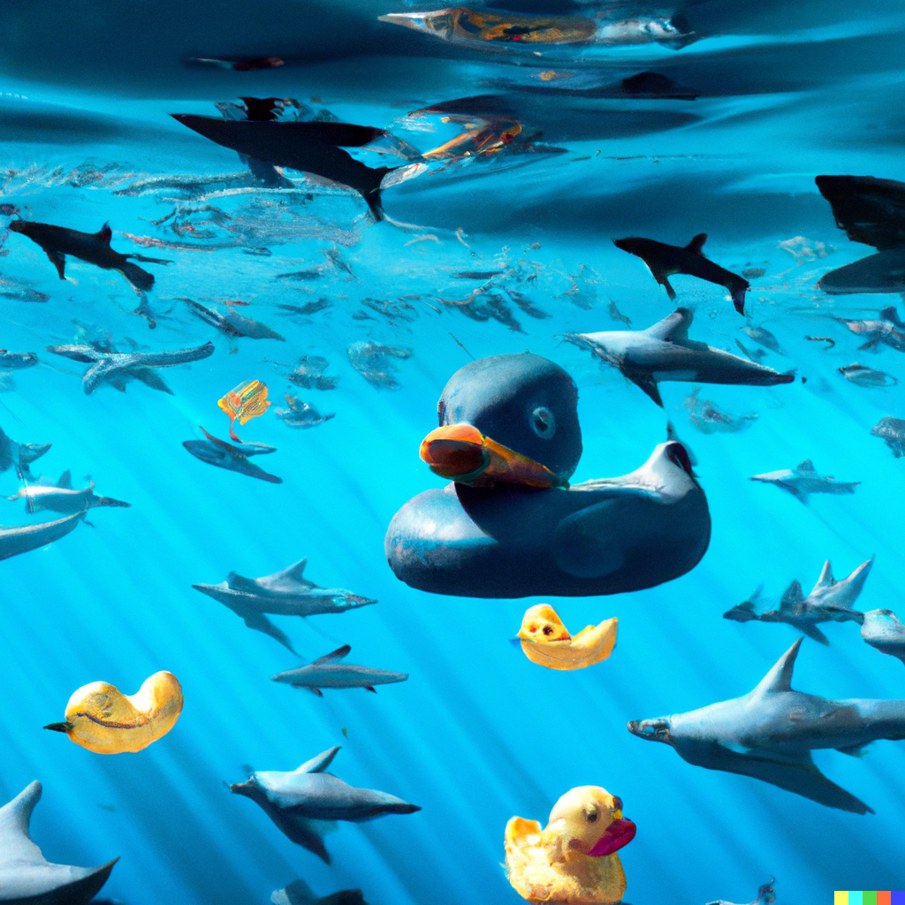

# Duck to shark

En este primer proyecto, he llevado a cabo una limpieza profunda (PROFUNDÍSIMA) de la sucia (SUCÍSIMA) tabla de datos 
'attack.csv'. La limpieza está separada en dos partes, cada una desarrollada y explicada en sendos documentos 'analysis_1.ipynb'
y 'analysis_2.ipynb'. El resultado de cada una es un archivo .csv progresivamente más limpio, siendo el archivo final 'attacks_clean2.csv'. En el archivo 'fun.py' se ha definido la única función que se ha usado recurrentemente en ambos cuadernos, 
dejando el resto definidas y explicadas en el interior de los mismos.

Ha sido un proceso largo, tedioso, exasperante y satisfactorio de manera extraña. Espero no tener que limpiar nunca más nada parecido... hasta a Jason se le ha puesto cara de pez.

